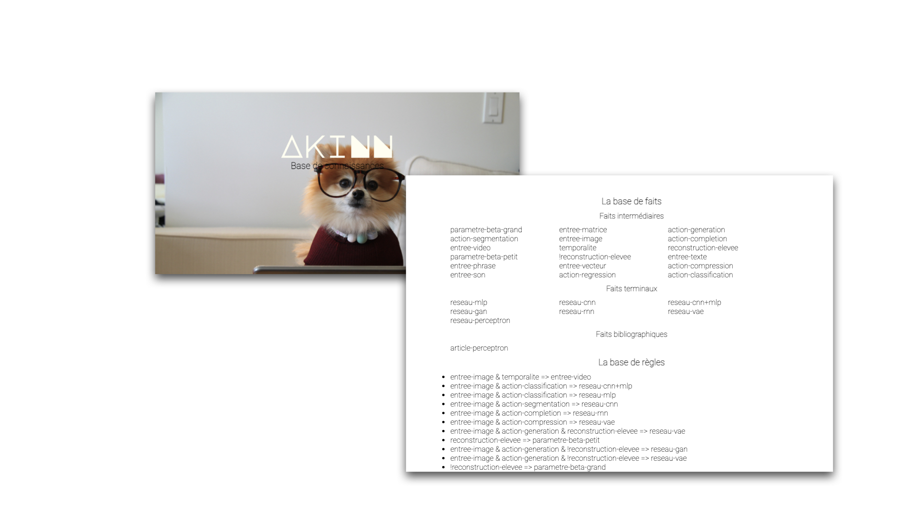

# Système expert - AkiNN

#         

_Auteurs:_ [Simon Audrix](mailto:saudrix@ensc.fr) & [Gabriel Nativel-Fontaine](mailto:gnativ910e@ensc.fr)

Ce dépôt contient un système expert, spécialisé dans le conseil lors de la création d'architectures de réseaux de neurones. Il s'agit du système **AkiNN**.

Il a été réalisé dans le cadre du module **Connaissances et Représentations** du parcours **Intelligence Artificielle** inscrit dans la 3ème année du cursus d'ingénieur au sein de l'[Ecole Nationale Supérieure de Cognitique](http://www.ensc.fr). Il utilise comme base un système de chainage réalisé par [Laurent Simon](https://www.labri.fr/perso/lsimon/). 

## Lancer l'application

Le système expert est "servi" sous la forme d'un serveur web dans un container.

```shell
git clone https://github.com/3a-ia-ensc/tp-systeme-expert 
cd tp-systeme-expert
docker build --tag akinn:1.0 .
docker run --publish 5000:5000 --detach --name akinn_container akinn:1.0
```

Rendez-vous ensuite à la page [http://localhost:5000/]( http://localhost:5000/) pour accéder à l'application.

## Architecture

### Les faits

Le système utilise une base de faits qui se regroupent en quatre grandes catégories:

- Quelles données l'utilisateur veut traiter
- L'objectif de son traitement
- La possibilité de faire un apprentissage supervisé ou non
- L'ensemble des architectures possibles

Ici l'ensemble des faits décrivant une architecture sont considérés comme terminaux, à l'inverse des trois autres catégories ou tous les faits peuvent être utilisés comme des faits initiaux.

Nous avons ajouté au système des faits "bibliographiques", ceux-ci correspondent à des éléments de bibliographie. Ainsi, le système est capable, en plus de déterminer la meilleure architecture de réseaux à utiliser en fonction du contexte, de proposer des articles de recherches associés à ces architectures.

### Les règles

Chacun de ces faits peut être utilisé en entrée ou en sortie de règles. L'utilisateur peut questionner le système en lui donnant en entrée un ou plusieurs faits initiaux ou terminaux. Les règles utilisent ensuite deux techniques de chainage pour naviguer dans la base de fait et inférer des conclusions.

#### Chainage avant

Les règles utilisent un système de chainage avant à partir de faits initiaux, cela lui permet de naviguer de règle en règle en fonction des faits reçus lors de la requête de l'utilisateur. Si une règle est incomplète, c'est-à-dire que le système ne dispose pas de connaissance sur l'ensemble des faits nécessaire pour l'appliquer, alors **AkiNN** peut demander à l'utilisateur de compléter ces règles en statuant sur les faits manquants. Partant de faits initiaux le système peut donc inférer une architecture de réseaux adaptée au problème proposé par l'utilisateur.

### Chaînage arrière

De même, un utilisateur peut donner en entrée un fait terminal. Dans ce cas, le système utilise une technique de chainage arrière afin de conclure sur les entrées possibles du réseau demandé. __AkiNN__ peut donc vous dire quelles données utiliser dans votre architecture.

## Interface

### Index (http://localhost:5000/index)

<p align="center">
    
</p>

### Base de connaissances (http://localhost:5000/knowledge_database)

<p align="center">
    
</p>


<p align="center">
    
</p>
